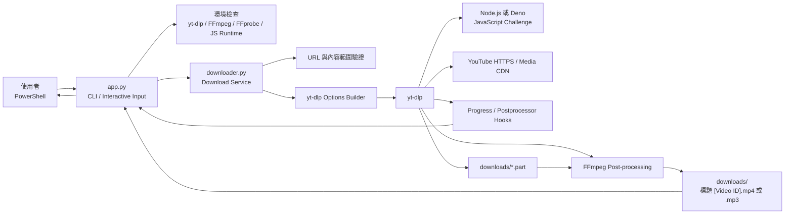
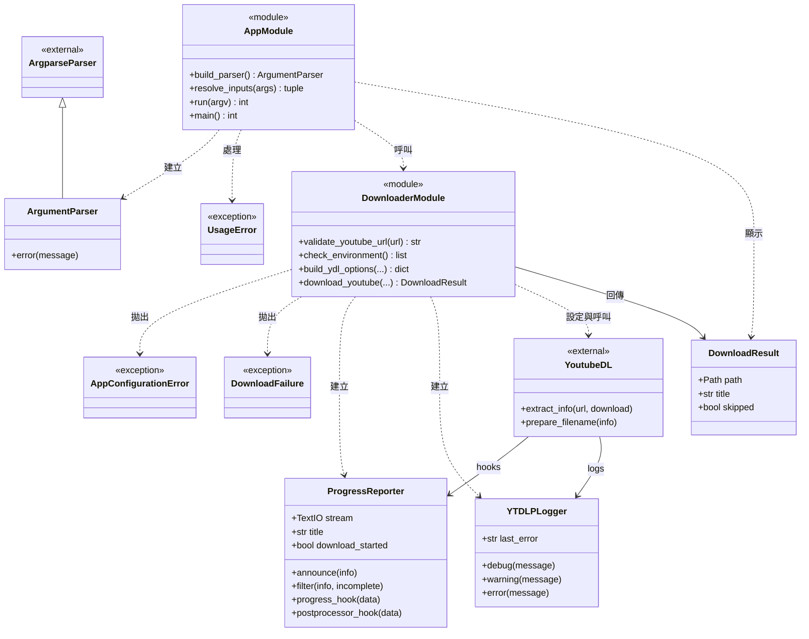
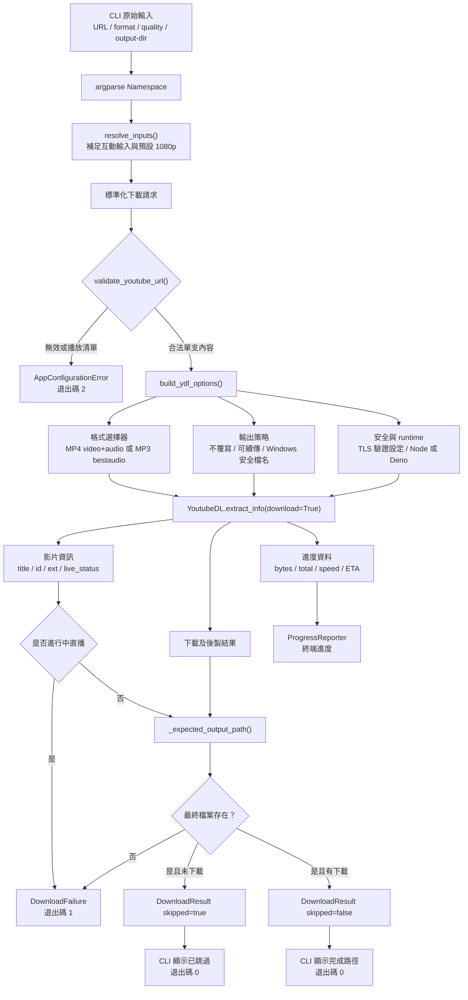
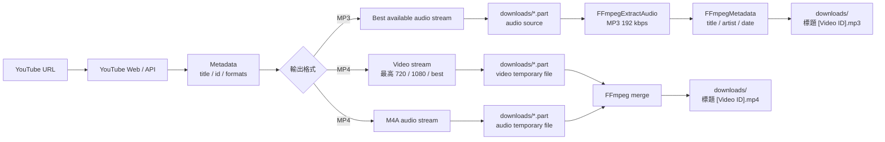
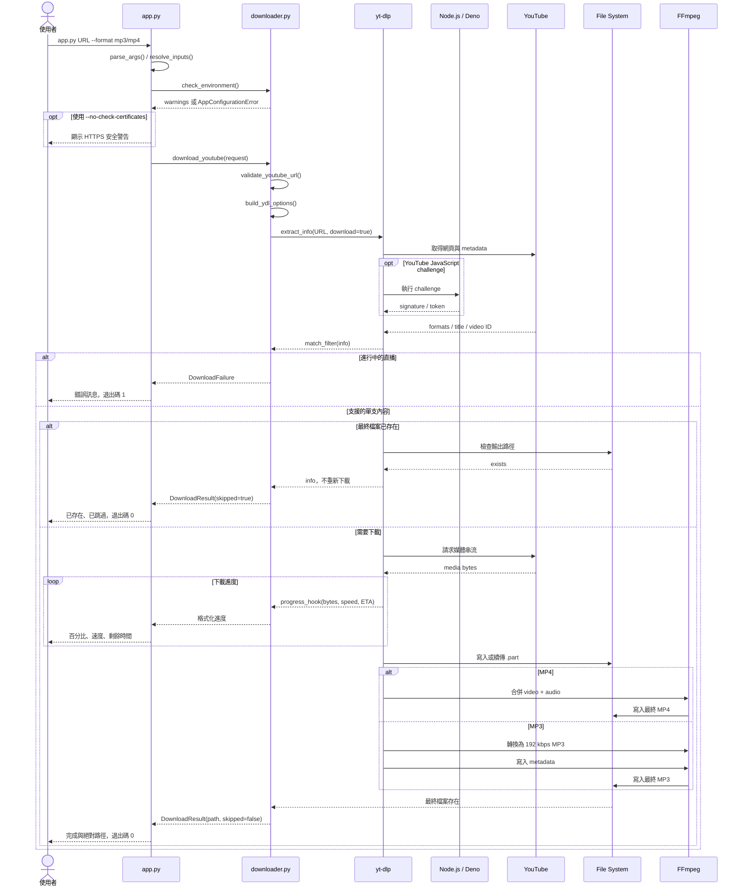
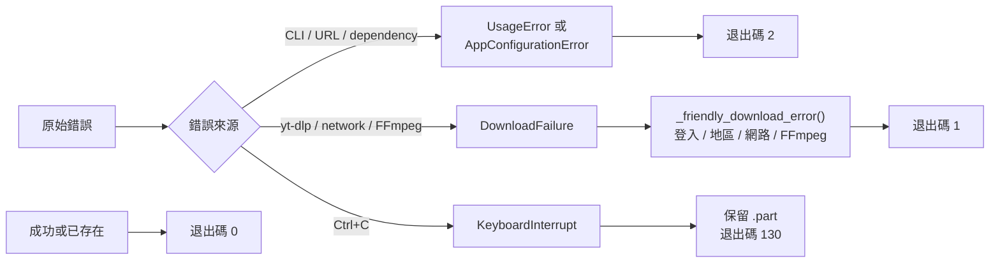
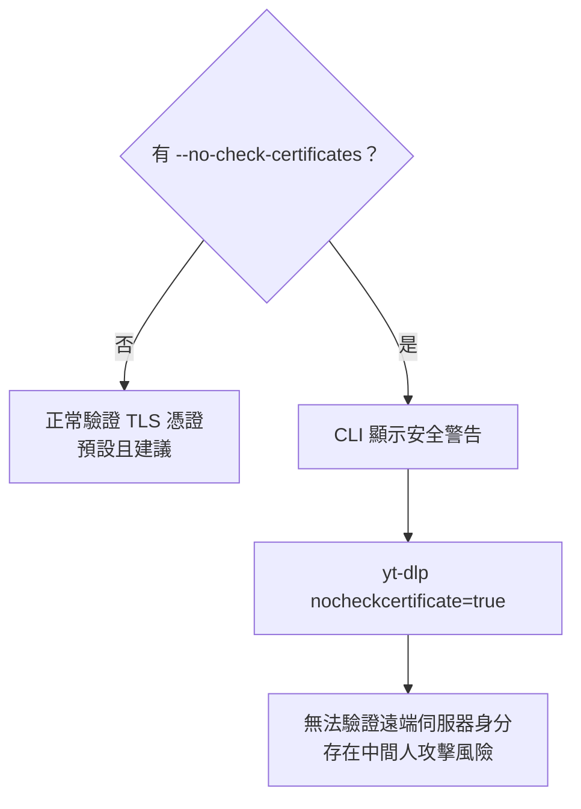
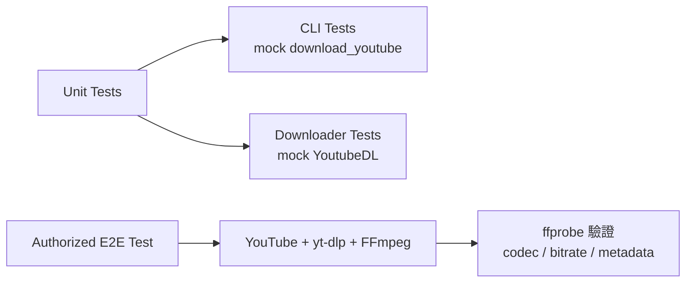

# YouTube MP4／MP3 下載器：程式與架構說明

本文件說明此 Python 命令列程式的元件責任、類別關係、資料流程、媒體資料路徑
及下載時序。使用方式與安裝步驟請參考 [README.md](README.md)。

## 1. 程式目標

程式接收單支 YouTube 內容網址，透過 `yt-dlp` 取得媒體串流，再由 FFmpeg
輸出為：

- MP4：最高 720p、1080p，或來源最佳畫質。
- MP3：最佳可用音訊轉為約 192 kbps，並寫入標題、作者與日期 metadata。

第一版支援一般影片、Shorts 與已結束的直播；不支援播放清單、登入內容及
進行中的直播。

## 2. 專案結構

```text
yt_downloader/
├── app.py                  # CLI、互動輸入、訊息與退出碼
├── downloader.py           # 驗證、yt-dlp、進度、FFmpeg 與錯誤分類
├── requirements.txt        # Python 套件版本範圍
├── README.md               # 安裝與使用說明
├── ARCHITECTURE.md         # 本架構文件
├── downloads/              # 預設輸出資料夾，不納入版控
└── tests/
    ├── test_app.py         # CLI 與退出碼測試
    └── test_downloader.py  # URL、選項、下載服務與錯誤測試
```

主要責任如下：

| 元件 | 責任 |
|---|---|
| `app.py` | 解析 CLI、補足互動輸入、顯示安全警告、呼叫下載服務、回傳退出碼 |
| `downloader.py` | 驗證 YouTube URL、檢查環境、建立 yt-dlp 選項、回報進度、解析結果 |
| `yt-dlp` | 解析 YouTube metadata、選擇媒體格式、下載及續傳 |
| Node.js／Deno | 執行 YouTube JavaScript challenge；優先使用 Deno，否則使用 Node.js |
| FFmpeg／FFprobe | 合併 MP4 串流、轉換 MP3、寫入 metadata，以及人工驗證輸出 |
| `downloads/` | 保存 `.part` 暫存檔及最後的 MP4／MP3 |

## 3. 整體架構



設計重點：

- CLI 與下載核心分離，下載邏輯可在不啟動終端機的情況下單元測試。
- App 直接使用 yt-dlp Python API，不解析容易改變的一般 stdout。
- 下載進度與後製狀態只透過 hook 傳回 CLI。
- 檔名包含 YouTube ID，降低不同影片同名造成的碰撞。
- `overwrites=False` 保護現有檔案；`.part` 保留供下次續傳。

## 4. Class diagram

`app.py` 與 `downloader.py` 以函式為主，因此圖中使用 `module` 表示模組公開責任，
並列出實際存在的資料類別、例外類別與 hook 類別。



## 5. Data flow

以下描述資料在各處理階段的內容，而非媒體檔案實際存放位置。



### 主要輸入資料

| 欄位 | 來源 | 規則 |
|---|---|---|
| `url` | 位置參數或互動輸入 | 必須是 YouTube 單支影片、Shorts 或直播重播 |
| `output_format` | `--format` 或互動輸入 | `mp4` 或 `mp3` |
| `quality` | `--quality` | MP4 可用 `720`、`1080`、`best`；預設 `1080` |
| `output_dir` | `--output-dir` | 預設為專案下的 `downloads` |
| `no_check_certificates` | `--no-check-certificates` | 預設 `false`；啟用時停止驗證 HTTPS 憑證 |

## 6. Data path

媒體資料不會載入為一個完整的 Python bytes 物件。yt-dlp 將網路串流直接寫入
磁碟，FFmpeg 再讀取暫存媒體並輸出最後檔案。



路徑規則：

1. 預設根目錄為 `<project>/downloads`，可由 `--output-dir` 覆寫。
2. yt-dlp 輸出模板為 `%(title)s [%(id)s].%(ext)s`。
3. Windows 不允許的檔名字元由 yt-dlp 處理，Unicode 中文仍會保留。
4. 下載中斷時保留 `.part`；成功後由 yt-dlp／FFmpeg 產生最終副檔名。
5. 最終路徑透過 `YoutubeDL.prepare_filename()` 計算，不從 console 文字解析。

## 7. Sequence diagram



## 8. 錯誤與退出碼架構



`YTDLPLogger` 保存 yt-dlp 的最後錯誤，再交由 `_friendly_download_error()` 分類。
這能讓使用者看到較清楚的中文訊息，但詳細診斷仍可使用：

```powershell
.\.venv\Scripts\python.exe -m yt_dlp --verbose --simulate "YOUTUBE_URL"
```

## 9. TLS 憑證繞過

一般情況下，HTTPS 憑證驗證保持啟用。只有明確提供以下旗標時：

```powershell
--no-check-certificates
```

`app.py` 才會顯示安全警告，並把 `no_check_certificates=True` 傳給下載服務；
`build_ydl_options()` 再設定 yt-dlp 的 `nocheckcertificate=True`。



此功能只應作為受信任公司網路的暫時相容方案。正式環境應由 IT 提供公司 CA，
讓 Python 正常驗證憑證。

## 10. 測試策略

- `test_app.py` mock 下載服務，驗證參數、互動模式、TLS 警告及退出碼。
- `test_downloader.py` mock `YoutubeDL`，不連線到 YouTube 即可驗證格式選擇、
  metadata、進度、檔案跳過、直播拒絕及錯誤分類。
- 真實端對端測試使用有權下載的短影片，最後以 `ffprobe` 驗證格式、位元率及
  metadata。


